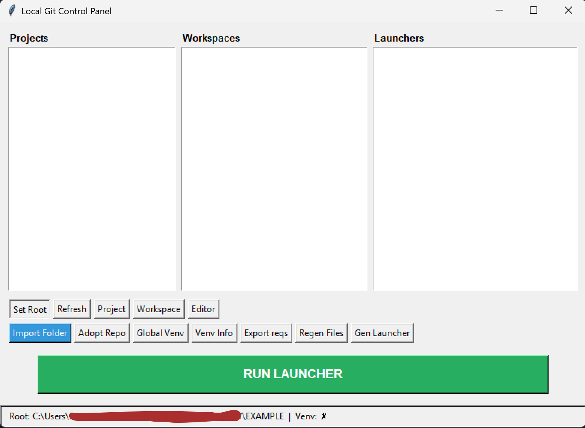
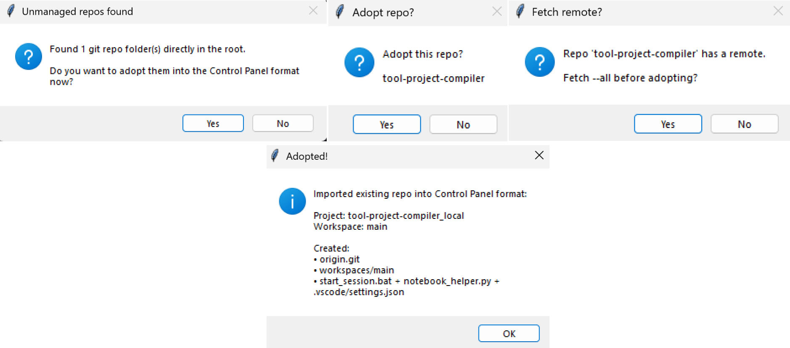
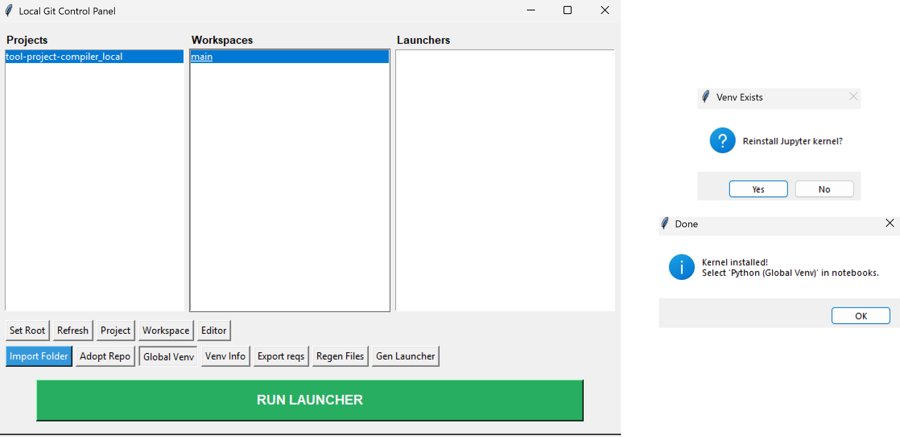
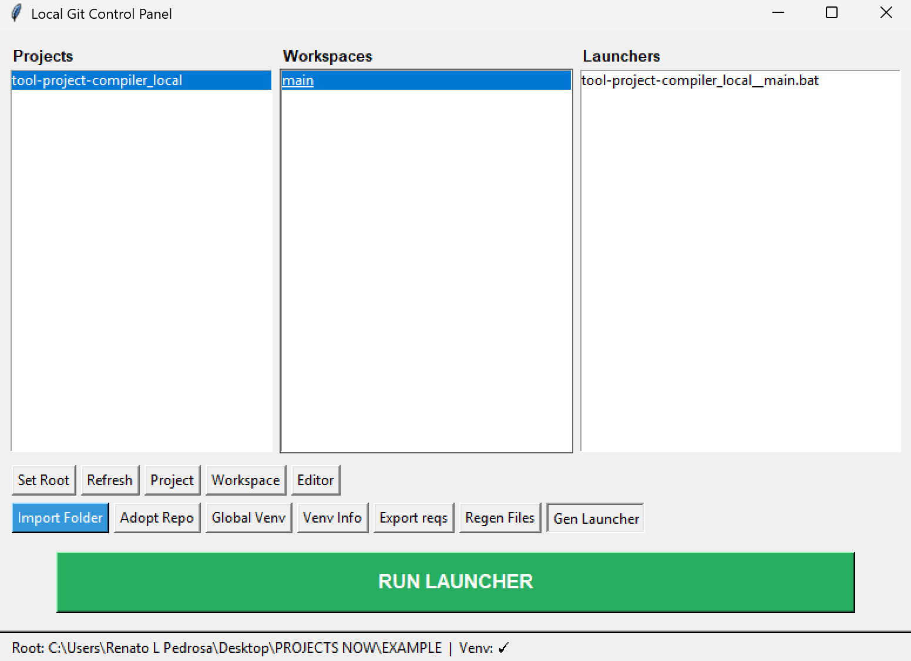
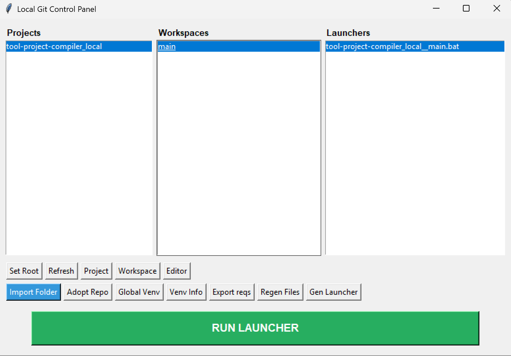

# Local Git Manager (tool)
A lightweight local Git workspace manager for Windows.

This tool enforces a structured project layout using a local bare repository (`origin.git`) and isolated workspaces (separate clones per branch or task). It also supports a shared global virtual environment to prevent dependency sprawl and streamline development sessions.

## UI Overview

<p align="center">
  
</p>


---

## Features

-  Structured project layout (`origin.git` + workspaces)
-  Workspace isolation (safe branch experimentation)
-  Optional global virtual environment
-  One-click editor launcher generation
-  Export `requirements.txt` from global venv
-  Import existing folders
-  Adopt unmanaged Git repositories
-  Optional remote fetch during adoption
-  Jupyter kernel integration for global venv
-  Portable mode support

---

## Managed Project Structure
```
<root>/
my_project/
origin.git/
workspaces/
main/
feature_x/
```

Each workspace is a full clone connected to the local `origin.git`.

---

## Recommended Workflow

1. **Set Root** → Choose a central projects folder.
2. **Create Global Venv** (optional but recommended).
3. **Create Project** → Initializes bare repo + first workspace.
4. **Create Workspaces** → Isolated clones for branches or experiments.
5. **Generate Launcher** → Open workspace in your editor.
6. **Select and Run Launcher** → Opens project in editor 
7. Open terminal (cmd) in workspace and run:
start_session.bat

## Demo
<p align="center">
  
</p>
<p align="center">
  
</p>
<p align="center">
  
</p>
<p align="center">
  
</p>
This will:
- Activate the global virtual environment
- Display Git branch and status
- Prepare the session for work

```
**EXAMPLE**
================================================================
 PROJECT:   selected_project
 WORKSPACE: workspace_name
================================================================

 [VENV] Activated: global_venv (venv-name)

----------------------------------------------------------------
 GIT BRANCH:
----------------------------------------------------------------
* main

----------------------------------------------------------------
 GIT STATUS:
----------------------------------------------------------------
On branch main
Your branch is up to date with 'origin/main'.

Untracked files:
  (use "git add <file>..." to include in what will be committed)
        .vscode/
        notebook_helper.py
        start_session.bat

nothing added to commit but untracked files present (use "git add" to track)

================================================================
 Session ready!
================================================================
```

---

## Adopting Existing Repositories

If unmanaged Git repositories are detected inside the root folder, the tool can:

- Detect them automatically
- Offer adoption into structured format
- Fetch remote branches (optional)
- Convert them into managed projects

---

## Global Virtual Environment

The global venv:

- Prevents system-wide dependency pollution
- Can be reused across multiple projects
- Supports Jupyter kernel installation
- Allows exporting `requirements.txt` per workspace

---

## Portable Mode

By default, configuration is stored in:
**%LOCALAPPDATA%\LocalGitControlPanel**


To run fully portable (everything next to the script):

set PORTABLE=1
py local_git_manager.py


---

## Tech Stack

- Python 3.9+
- Tkinter (GUI)
- Git CLI
- Windows batch scripting

---

## Designed to:

- Enforce clean Git workflows
- Encourage branch isolation
- Simplify environment management
- Reduce repetitive setup friction
- Provide reproducible dev sessions

---
